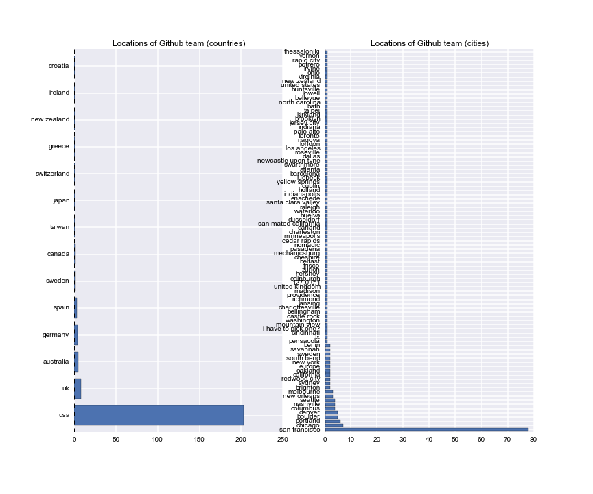
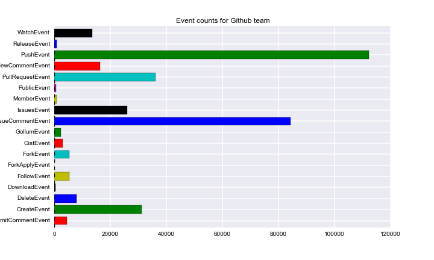
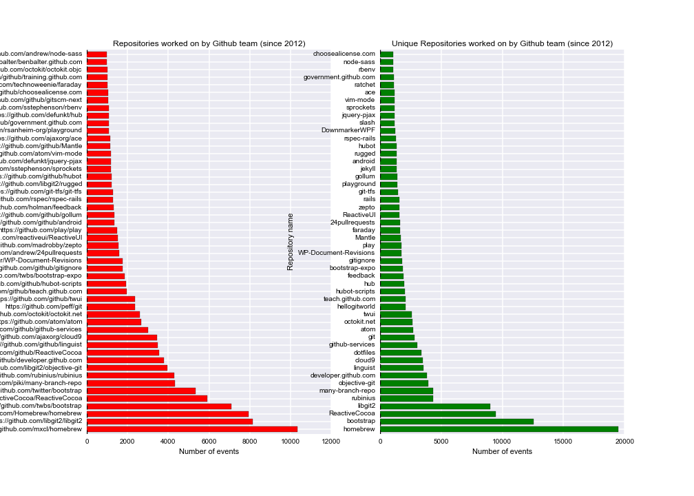
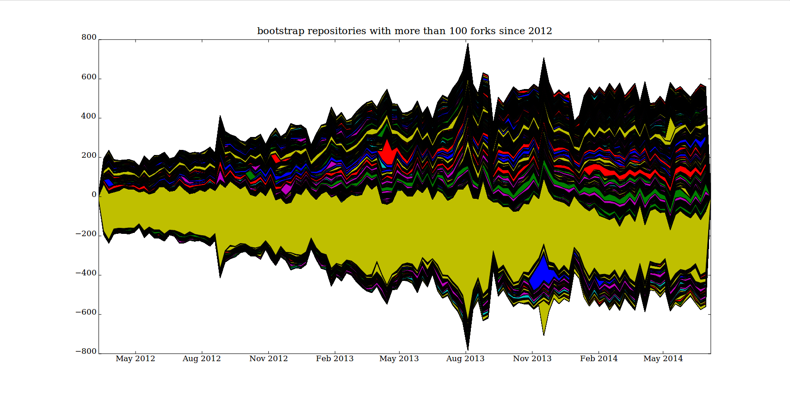

# Code-traffic: code repositories, crowds and urban life

Adrian Mackenzie
Sociology Department, Lancaster University
a.mackenzie@lancaster.ac.uk

> The initial step can be made through the venerable geographical act of mapping the expanding realm of machinekind, clearly part of the remaining terra incognita. [@Horvath_1974, 188]

Code deeply shapes  infrastructures, devices, services, protocols, and many mundane capillary orderings in cities. Or does it? Might not code itself be patterned by the urban, by dynamics and transients, by diagrams and vectors, that code itself expresses and enunciates without fully controlling? In what frame and at what levels of abstraction does the density and plurality of this coding become legible or even enumerable? Writing in 2002, Nigel Thrift and Shaun French addressed a version of these questions: 'is there any way of making a more general assessment of software in the city?' [@Thrift_2002,  314].  They sketch some possibilities, ranging from hegemony to haunting:

> It would be easy at this point to fall back on some familiar notions to describe software's grip on spaces like cities. One would be hegemony. But that notion suggests a purposeful project, whilst software consists of numerous projects cycling through and continually being rewritten in code. Another notion would be haunting. But again the notion is not quite the right one. Ghosts are ethereal presences, phantoms that are only half- there, which usually obtain their effects by stirring up emotions – of fear, angst, regret, and the like [@Thrift_2002, 311-312].

In this take on software in the city, they observe 'numerous projects ... continually being rewritten in code.' The rest of this chapter could be seen as an update on that observation from 2001. What has happened to the cycling through and re-writing of code?[^1.1] They go on to  describe three geographies that were cycling (or as I'd prefer to say, trafficking)  code through cities: a geography of *writing code*, a geography of *power and control*, and a geography of *indeterminancy.*  

[^1.1]: Thrift and French's empirical response to their own question begins with the Y2K bug, and the long lists of software potentially affected by it: keypad locks, pagers, solar panels, smoke detectors, camcorders, VCRs, elevators. Although these lists now look dated, when a similar listing would include many  things that didn't exist in 2002, Thrift and French's description of the effect of software development on urban space remains recognisable: 'we will exist in a broadband world in which the internet will be a permanently available ‘cloud’ of information able to be called up through a number of appliances scattered through the environment. These appliances will be something more than portals for information. Rather, like many other devices which will not have internet connections, they will be "practice-aware"' (315) and 'will, through a process of cultural absorption into practices, sink down from the representational into the non- representational world, so becoming a part of a taken-for-granted set of passions and skills' (318). The fact that these developments more than a decade later are still very much in train suggests that there is something quite predictable about the development of software and coding in organising urban life and spaces.  

>  The first of these geographies is the most obvious, the large and complex geography of the writing of software – of the production of lines of code – a geography that takes in many different locations and many different languages and which has been built up progressively since the invention of programming in the 1940s [@Thrift_2002, 323].

According to Thrift and French, the geography of software writing clusters around  key places and regions: Silicon Valley, New York, London, and a number of auxiliary software mass production zones (often concentrating on tasks like consulting, testing and support) in countries like Ireland and India. China, Russia and Brazil are not mentioned.  As we will see, this geographic centring still matters, but in a somewhat re-configured form: code cycles through platforms that tremendously re-distribute the production of lines of code.

A second less concentrated geography of power, conceived in Foucaultean terms as the conduct of conduct, or massive proliferation of corporeally practiced rules, was also  unfurling through software: 'in essence, we can say that it [software] consists of rules of conduct able to be applied to determinate situations' [@Thrift_2002, 325]. Through this power-geography, software increasingly interlinks rather than compartmentalises urban processes. In many ways, the app economy, the virtualization of computing into cloud and containerised infrastructures, and the spectacular growth of social media platforms or indeed the internet of sensor-equipped things attests to an intensified application of rules to determinate situations. Again, coding itself, the process of specifying, configuring and propagating these rules of conduct, has not been exempt from the conduct of conduct. Coding has been powerfully re-coded in recent years.

Thrift envisaged a  final more open and less localised geography in which abundance produces indeterminacy and lack of closure:

> the general profusion of software, its increasing complexity and consequent emergent properties, all count as means of producing playful idioms that have not been captured by dominant orders. Software's very indeterminacy and lack of closure provide a means of creating new kinds of order (328). 

In this geography, 'profusion' and 'increasing complexity' generate less orderly or regulated idioms. These playful idioms are largely irreducible to the geographic centres of coding or power-generated control practices, and therefore take on singular forms, arise in unexpected locations and articulate non-representational processes. Thrift and French attributed this generative aspect of software to the phenomenality of code  as a form of traffic: 

> Software is more like a kind of traffic between beings, wherein one sees, so to speak, the effects of the relationship. What transpires becomes reified in actions, body stances, general anticipations. We would argue, then, that software is best thought of as a kind of absorption, an expectation of what will turn up in the everyday world.[@Thrift_2002, 312]

The 'traffic between beings' they refer to here, the reification of 'general anticipations,' the curiously contrasting descriptions of software as absorption _and_ expectation could be seen as implicitly urban. They concern 'traffic' in everyday worlds. In this third geography, the traffic in beings, we might see processes of composition that not only generate much code traffic, but assemble compositions of people and things that turn up new things. 

More than a decade later, these geographies remain in play. Code work is done in more or less the same places; and the coded conduct of conduct certainly continues. But when  we think about code in terms of traffic, what has happened to it? What kinds of new order have eventuated?[^1.3] As I will suggest, a complicated set of re-orderings of code traffic have occurred. The centred geographies of code production have been somewhat de-centred through a much more multi-lateral or networked flow of code. At the same time, the very arrangements that have dis-located the centres of software production have themselves become the platform for new platform-based centres or hubs for code. In turn, these centres attract and generate saturated streams of coding traffic that bring new indeterminacies, diverse distributions, encounters and adaptations into play. 

[^1.3]: Writing in 2014, Thrift again asks addressed coded cities: 'Take just the case of coded cities understood as a whole,' [@Thrift_2014, 13], and then proceeds to offer a sixfold topography of the code city - as externalization of capitalist power,  as prescribed matter of concern, as care-laden responses to the demand for resilience, as projected-retrojected dream life, as navigational geometry, and as materialized visualisation. He finally suggests that something links this diversity: the possibility for 'these entities to learn ... to transform themselves.'   Echoing the 2001 discussion of the geography of indeterminacy, he attributes this possibility to 'emergent tendencies arising out of complexity' or 'through simple happenstance which places them in unexpected situations which require adaptation' (13). The sixfold evocation of the coded-city somewhat complicates the geographies of software in the city, but it reiterates the transformative capacity of indeterminacy.  The 2001 formulations on indeterminacy and 'traffic in beings' grow into forms of novel encounter in 'unexpected situations.' (While urban sociology has long understood cities in terms of encounters between strangers, Thrift's account shifts the emphasis to unexpected encounters between other beings.)  Coded cities' 'capacity to learn' transpires, according to this account, in elementary forms of movement understood as *code traffic.* If this is the case, the 'authoring,' the 'learning', and the transformations should not only be traceable in code, but coding itself matters greatly as a process where externalizations, matters of concern, geometries,  projections, visualizations, resilience-care, etc. come together and affect each other. The volume and composition of the traffic of coding itself as a cycling and re-cycling might be an important trace of more general transformations.

We could give all of this a Deleuzean or a Tardean formulation. Deleuze and Guattari write, 'assemblages are passional, they are compositions of desire. Desire has nothing to do with a natural or spontaneous determination; there is no desire but assembling, assembled desire. The rationality, the efficiency, of an assemblage does not exist without the passions the assemblages bring into play, without the desires that constitute it as much as it constitutes them' [@Guattari_1988, 399]. Deleuze and Guattari's notion of assembling as passional composition or putting together suggests one way of thinking about the effects of code traffic. Alternately, the  'traffic between beings' moves and  is moved  along various paths  through processes that we might understand,  drawing on crowd sociologists  such as Gabriele Tarde and Robert E. Park, as _imitation_. For both Tarde the microsociologist of crowds and Park the urban sociologist,  imitation powerfully yet effects repetition and invention, and generates new urban forms of various kinds [@Borch_2012]. In particular, Tarde speaks of  'coadaptation of imitative fluxes, a cooperation, even in an individual brain, but always a multitude of agents social and infinitesimal, and their ordinary ideas' [@Tarde_1902, 270]. While there is much to discuss here (for instance, Tarde's political conservatism and anachronism poses analytical problems), the 'coadaptation' of imitations between a  multitude of infinitesimal agents, beneath and around individuals, suggests a way of thinking of what happens in code traffic.  Understood either as passional compositions or co-adapting imitative fluxes, we might come closer to concretely understanding how the transient coagulations and diffusions of code traffic may play out in control structures, in architectures, in matters of concern, etc.  Examining patterns of imitation in code moves the emphasis away from code-shaping-cities to code-as-crowd. In the code-crowd, imitation is not just follow-the-leader, although this is quite prevalent, but also mutual shaping of imitative fluxes running between people and machines in places.[^1]

[HERE]

[^1]: This, I should note, is a departure from most crowd theory, crowd psychology and crowd sociology. In most cases, objects hardly figure at all. As I will sketch below, points of identification occurs between systems, platforms, protocols and patterns just as much as  between individuals. 

To treat *code-traffic* in terms of Tardean crowd sociology as co-adaptation of imitative fluxes is  not to deny the production and power geographies of code. It is not to say that code does not still act on cities, on space, on public and private practices.  High profile and much discussed changes taking place in computational platforms (mobile devices, cloud, etc.) and in algorithmic processes (machine learning) intricately reorganise urban life. What transpires there is rapidly reified in actions, body stances, etc.   But it might also be worth seeing how code has become a mixing process, re-configuring the architectures, the buildings, the logistics and diffuse circulation of individuals in cities. We would, from this standpoint, no longer concentrate on following how software emanates from global production centres  as hierarchical or supervisory control structures  reorganizing cities.  Furthermore, we would no longer focus on isolated pieces of software, systems or applications but on the transverse flows that change how code itself moves and takes shape. We would apprehend coding itself as something closer to pedestrian and vehicle movements in a busy street in which branching, merging, starting, turning and stopping compose transient multiplicities adapted to particular problems and situations. That is to say, we might attempt to see code as  noisy, crowded, propagating aggregates in which juxtapositions, proximities and patterns of imitation multiply through each other. 

## `git` as code traffic: dangerous coagulation or regularized order?

The study of code-traffic poses some empirical problems, but we can glimpse some of the traffic in code via increasingly important code repositories. A huge number of code repositories (possibly around 50 million) are now hosted publicly online at code repository sites such as GitHub.com, Bitbucket.com, code.google.com and SourceForge.com.  Focusing on one of these repository hosting platforms -- GitHub.com, allegedly the 'largest code repository on planet' -- might be a way to begin to find a way of beginning to see traffic in code, and to track how co-adaptive, infinitesimal fluxes flow.[^3]  Code moves in and out of these repositories in many different ways. This movement is not logistically or hierarchically controlled. It constitutes a vast, complex reticular movement. Much of the flow of source code passes through a single piece of software called [git](http://git-scm.com/).  `git`, an English word for a male person who acts foolishly or annoyingly (often in a crowd), was chosen by Linus Torvalds in 2005 as the name for a new concurrent versioning system for source code. In 2002, Torvald's work on GNU/Linux  epitomised for many people the emergent power of open source collaboration -- 'crowd-sourcing' -- on the internet to build things outside the geographies of the software industry.  (But even then, as Thrift and French observed,  Linux was a quite centralised hierarchically and industry-supported software project). In turn, the `git`    a revision control system for code that allows incremental changes made by many people working a common software project to merge with or diverge from each other. `git` is today probably the most widely used revision control system for code ( by the interestingly named `subversion`). In practice, a whole series of converging and diverging movements of cloning, forking, pulling, pushing, requesting, branching and merging comes out of `git`. Often used on commandline, commands such as

>`git clone
>git commit
>git push
>git pull
>git branch
>git merge`

suggest some of the elementary movements that generate code traffic in and out of the millions of repositories.   For instance, some `git` commands replicate whole bodies of code, while others simply add, remove or alter small bits of code. These scale-variations, I would suggest, matter to the flows of imitation that occur. Movements of code can take place very incrementally, as small bits of code move around and they can take place on a large-scale as whole bodies of code travel between different bits of software. `git` as a contemporary site of coding merits much more empirical description than this, but for the present purposes `git` represents the distributed cycling and re-writing traffic in code. These movements, while certainly not unique or unprecedented in the history of inscriptive techniques, record-keeping system or archives, have become chained and interlinked in recent coding cultures in ways that generate the rapid transformations associated with many millions of code projects. 

[^3]: It might also be a way of undermining the over emphasis on algorithms that  blocks light, I would suggest, on the richer cultural and social traffic in code forms.

We should note that Torvald's intention in writing `git` was to radically de-centralise code repositories in the sense that no particular of a repository would be the 'master' or hub.  In principle, a decentralized network of repositories  'push' and 'pull' code to each other. Different repositories would clone and branch off from each other, and occasionally would merge again, but not necessarily.  The geography of coding would become less aligned to individual developers in specific times places and times, and more open to a range of different styles of  code movement, ranging from an uncontrollably fluxing miasma of micro-projects through to vast hierarchical code architectures. Torvalds did not reckon with the increasingly social coding of coding. Since late 2007, GitHub has provided  a  hosting platform for many git repositories, and now attracts the largest share of code traffic of any code repository.  From the perspective of  the `git` software, GitHub is just another remote  code repository. But given that many, in fact around 13 million, local `git` repositories have GitHub.com as their remote repository, then GitHub becomes a hub for `git.` The network and code traffic that now runs through GitHub is on the scale of a mid-size social media platform. That is, with 13 million repositories, 6 million developers, and around 250 million events in the public event stream, GitHub itself is a kind of code terminus, whose functioning, architecture, and machinery symptomatically enunciates contemporary code traffic more generally. 

## Github as a `git` terminus

In the spirit of `git`, GitHub.com  promises a radically de-centered patterning of code traffic. But this `git`-like mobility of code stands in tension with Github's own existence as a platform (indeed a platform for 'social coding'). Github itself as a platform should epitomise the kind of code traffic we are concerned with here. In some ways it does.  Several hundred GitHub staff ('Hubbernauts') are scattered across a  dozen or so countries, a somewhat dispersed geography for a relatively specialised software company started in 2007 in San Francisco. GitHub work life is also putatively non-hierarchical, with no management hierarchy, only a `git`-like structure of fluid teams working on projects.[^4] In principal, GitHub itself therefore makes itself into something like a terminus for code-traffic, and itself, is constructed and maintained via just such traffic. So the hub-ness or centrality of GitHub  is something to be produced or made via a combination of geography, rules of conduct and new forms of order flowing through code. 
 
[^4]: The only problem with this is that the CEO and  GitHub co-founder, Tom Preston-Werner (a.k.a `mojombo`, id = '1'  in the GitHub user list -- in other words, the first Hubbernaut ever) has recently had to step down after much publicised allegations of sexist and discriminatory language and behaviour in the workplace [@TBA]. I largely leave the workplace dynamics of GitHub aside here, but they are symptomatic.

If we look at the code-traffic generated by the 233 staff listed as the GitHub team, there is some evidence of their `git`-like activity as they write the code that constructs, augments, re-shapes or expands Github. The geography of their work on GitHub is still very much centred on San Francisco (followed by Portland, Chicago, Seattle, Boulder, etc.), despite claims of de-centralization.[^6]  As Thrift and French argued, geographic localities still matter greatly to code-traffic.   But this largely localised traffic is perhaps less important than the kind of movements it entails.  The table below offers a view on what happens as the several hundred Hubbernauts work on GitHub as a  platform.[^5] It is important to note that only some of the GitHub code appears here. The anchoring  repository `github/github`, the repository that contains the code for whatever GitHub becomes, remains private.

[^5]: We can see some of what the GitHub team has been doing in GitHub repositories by running queries against the GitHub API (Application Programmer Interface) or using the GithubArchive.org archived datastream of GitHub activity. All of the numerical data in this paper results from such queries. In the case of Figure 1, the query process went: find all the public repositories on which the named 'actor' works, and count the different actions they perform on those repositories. If we run this query for all 233 Hubbernauts as well as `mojombo`, then something of the network of work done on GitHub itself begins to appear. This assumes that the coding of Github can be seen in `git` traffic. 

[^6]: This geography refers to the 'Hubbernauts' themselves, not to Github users who are much more dispersed. 

The  events shown in Figure 1  roughly summarize some of the code-traffic associated with Github's own code during the last few years.  The mix of different event types suggests something of the flow of code. While PushEvents embody code writing, and ForkEvents imply imitation, many other events, including IssueCommentEvents, PullRequestEvents,   IssueEvents and WatchEvents, point to different kinds of traffic in code. In some ways, the variety of event categories shown in the figure already highlights some of the analytical problems in tracking code-traffic.  The events  mix `git`-related practices such as pushing or forking with other GitHub-specific practices such as pull-request or following. 'Social' events outweigh the technical events, and  disentangling what belongs to `git` from what GitHub has added would be difficult.  GitHub as a terminus for code-traffic  re-channels and re-shapes much of the traffic that passes through it. To the ongoing capillary flow of code it adds all the social media-style baggage of followers and  watchers, comments, liking, and tagging. So code-traffic through Github repositories is formatted much more in terms of watchers and followers, in much the same way that people watch or follow others moving along a street. This socialisation of code traffic will, as we see below, generate its own kinds of traffic. 

## GitHub as collective 

How would a social media platform affect the traffic in beings or the cycling-rewriting practices of coding? Hubbernauts such as `defunkt`, `mojombo`  or `technoweenie` have thousands of followers and hundreds of repos (i.e. repositories) to their names. While the GitHub team has participated in some way or rather (including just watching) in a total of 17000 public repositories, they work much more heavily on several hundred of these (see Figure 2).

The top repositories  display some important features of  GitHub  as an imitative process. Many of them relate to GitHub or `git` itself. It is hardly surprising that Hubbernauts contribute to the `git` project itself or re-implementations of `git` such as `libgit2`, `objective-git`, `rugged`,  `hub` (a 'wrapper' for `git`) or `many-branch-repo`. All of these projects are imitations, re-implementations or variations on `git.` They also make contributions to repositories that augment or build out GitHub, ranging from documentation websites such as https://developer.github.com or http://teach.github.com,  websites that promote or showcase GitHub (https://government.github.com/) or its features (`24pullrequests`), repositories for testing GitHub (`hellogitworld`), repositories that act as Q&A sites about GitHub(feedback), repositories that contain code for accessing the GitHub APIs (http://octokit.net) or link GitHub with other webservices (`github-services`) or other code development platforms (`git-tfs`). 

Hubbernaut code traffic  heavily centres on the practices of  writing, copying, viewing and packaging code at various levels.  Repositories such as `cloud9`, `dotfiles`,  `gitignore`, `vimmode`, `rbenv`, `ace`, and `atom` figure prominently, and this constantly re-tooling and re-configuring of coding at the level of hand and eye movements. Arranging packages and libraries of code so that they are ready to hand is another major activity. The most active repository, `homebrew`,  manages and updates software packages for MacOS computers popular with coders. There are also quite a few repositories that concern how people sit down and keep coding. `Play` is a music server: 'We have employees all over the world, but `Play` lets us all listen to the same music as if we were all in the office together. This has actually made a big mpact on our culture' (https://github.com/github/play). Similarly, `Hubot` and `Hubot-scripts` are part of  a software robot system  that the GitHub team extensively use to maintain the GitHub platform,  run the many online chatrooms they use as they work with each other, to continuously deploy the changes they make on the master branch of `github\github` into production and to send updates to various social media platforms. One Hubot runs  the whole of GitHub. Finally, many repositories listed here concern the infrastructure of GitHub.com as a software platform. Some are language-specific environments heavily used at GitHub such as `rubinius`, an implementation of the Ruby programming language. Some such as `rails` are libraries that provide much of the dynamic infrastructure that holds GitHub as a collection of servers and databases together as a platform. Other repositories such as `choose-a-licence` or `linguist` implement GitHub features to do with licensing or tagging repositories by programming language.  Since GitHub repositories can also function as webpages, blogs, or wikis, other repositories such as `jekyll` and `gollum` provide code for that. Other heavily used repositories such as `bootstrap`, `zepto` and `twui` provide elements of the graphic layout, colours, styles, fonts and icons that comprise the visual appearance and interactive features of GitHub pages (and I return to this kind of software below).

The panoply of code repositories frequented by the Github staff suggests something more general about the effect of code traffic.  The fabric of GitHub as a platform is constructed and connected along many edges. It folds in many different elements on various scales, ranging from almost micro-perceptual configurations such as editor settings through to large infrastructural developments such as `elasticsearch`. GitHub comprises  programming language implementations, server infrastructures, deployment mechanisms, web-frontend frameworks, various social media formats (wiki, blog), Javascript page and graphic elements, as well as the code versioning system of `git`, robots that automate chatrooms and servers that streams music to developers in different places and time. All of these together recursively construct the platform, with varying degrees of coherence and visibility, ranging from the vital `github/github` repository through to the many public facing repositories that Hubbernauts either release to the world or participate in publicly.  The flow of elements comprising GitHub is, I suggest, typical of the ways in which code traffic concatenates things today. The mixing of different things in code traffic generates the forms, the changes in scale, the new modes of distribution, partitioning or localisations associated with contemporary life. The platform Github, in this case, itself a platform in principle oriented to the multiplication of code traffic, is a mixed architecture and a somewhat disordered multiplicity.

The recursive work of Hubbernauts on Github can be seen as projected  over the three geographies described by Thrift and French. We can now see that the geographical centring of software writing still largely applies, but subject to some significant transformations in how it relates to urban settings. The `git` version control processes open centres to  more distributed and mutable collectives. The widely scattered geography of the Github team suggests something of this.  The second geography of power/control (conduct of conduct) no doubt runs through much of what  Hubbernaut's make (and here we could think, for instance, of the many DCMA takedown notices posted at [https://github.com/github/dmca](https://github.com/github/dmca), or the recent denial of service attacks on Github attributed to the Chinese government, or the repo `choosealicence` that seeks to regulate  flows of code according to legal licence). This power geography, however,  seems secondary to the geography of indeterminacy or the 'new forms of  order' that GitHub itself exemplifies and that it seeks to host into being by building out the GitHub platform as a hub for previously widely dispersed and somewhat vagabond flows of code. 

Certain elements of the platform hold together more strongly together than others.  For instance, `libgit2` generates a large number of imitative events (cloning or forking)  because the `git` functionality of committing, branching, merging, forking, cloning, etc underpins nearly all of the other flows of  imitation associated with the growth of 13.2 million repositories and several hundred million events.  Typically of such entities, `libgit2` migrates throughout the software development ecosystem so that 'bindings' to `libgit2` have been made in almost any programming language imaginable, from Delphi to Lua, as well as to database backends such as `MySQL`, `redis`, `memcache` or the ubiquitous `sqlite`.  The broader point here is that code traffic in and around GitHub is itself constantly transformed, modified and intensified by the flows of imitation that Hubbernauts themselves semi-consciously generate as they assemble the platform. Music, robots, editors, libraries, databases and webpages intersect with each other in the small-crowd teams of GitHub work and in the object of their mimetic immersion, GitHub itself. 

## Github as convolutional process

At  the same time as Github takes shape through convolutions that transform forms through their moving integration with other forms, Github as a terminus for code traffic seeks to socially code flows of code.  The 'social coding' apparatus they create -- Watchers, Followers, stars, showcases, search facilities, along with their attempts to render code flow more like public spaces (see the 'showcases' at [http://github.com/explore](http://github.com/explore) for examples of this public-making) -- does not tame or corral the imitative fluxes on GitHub. The primary fluxes are more networked than the social media apparatus that GitHub codes around `git` because they are not dependent on the formats and facades supplied by the GitHub platform. In other words, these convolutional fluxes are the most crowd-like aspects of coding, and they criss-cross geographies, cities, feeding into and overloading Github geography in key respects.

How would we characterise something of these relatively pre-social imitative fluxes in the GitHub traffic?[^6] A simple comparison between repositories on Github in early 2007 and in 2014 suggests something of the tension between the efforts to socially code the fluxes and code traffic.  The early repositories on GitHub by creation date suggest a rather orderly and sensible traffic in beings. Table 1, which shows the first 20 repositories on GitHub, dating from 2007-8, lists repositories created and worked on mainly by Github Hubbernauts themselves. These are the repository that somewhat recursively hold the code from which Github was being made. Repository names on GitHub are lightly formatted. The first part of a repository name refers to a person or organisation ('mojombo', 'wycats', etc.) and the second to the specific code repository. Both parts of the full repository name are interesting since they vary between humans and things, between individuals and groups. Their constant variations bear the traces of the complicated intersection between people and things, between coders and code that looms large in code traffic. For the present purposes, however, the second part of the name is more symptomatic since it refers more directly to the code. In the early days of GitHub, these names are largely comprehensible in terms of the GitHub platform itself. Names like `grit`, a Ruby-language version of `git`, `git-wiki` or `merb-core` (a Ruby web-development framework) nearly all relate to various aspects of GitHub as a platform under development.  Other platforms and concerns are already present (`amazon-ec2` or `ebay4r`) but they are somewhat marginal to the work of developing a platform to host `git` repositories. 

[^6]: Here, like Thrift's,  my analysis of the coded-city needs to become more psychedelic. Tracking imitative fluxes means engaging with things that inherently lack any full formatting or clear outline. I focus here on the names of  repositories and the names of actors. I have argued elsewhere that naming practices and code names spaces offer a rich resource for thinking about recursive and imitative processes in software culture [@Mackenzie_2014a]

  order|2007|2014
  ---|   --- | ----

  1 mojombo/grit    |2m1tsu3/practice
  2 wycats/merb-core    |tylerdmace/ledomme
  3 rubinius/rubinius   |yehiaelghaly/xssya
  4 mojombo/god |istvan-antal/commandjs
  5 vanpelt/jsawesome   |JohnKrigbjorn/ObjectOne
  6 wycats/jspec    |chenx/Ci35_1
  7 defunkt/exception_logger    |mohsenbezanj/AI_Project
  8 defunkt/ambition    |Dineshkarthik/blogengine
  9 labria/restful-authentication   |sapanbhuta/Sapari
 10 technoweenie/restful-authentication |gwoodroof/chat-gwoodroof
 11 technoweenie/attachment_fu  |tryuichi/Hello-World
 12 topfunky/bong   |prateek0020/NepTravelMate
 13 anotherjesse/s3 |discoverfly/discoverfly.github.io
 14 anotherjesse/taboo  |evan-007/ng-wikiful
 15 mojombo/glowstick   |sanemat/zipcode-jp
 16 wycats/merb-more    |donreamey/PJKiller
 17 macournoyer/thin    |discoverfly/discover
 18 jamesgolick/resource_controller |jkkorean/MIUI-KK
 19 defunkt/cache_fu    |rtofacks1/ionic-app
 20 bmizerany/sinatra   |jkkorean/MIUI-JB
 
-----------------------------------
Table 1: 20 early and recent repositories on Github.com    

A similar list from seven years later  in 2014 reveals many complications (see column 3 of Table 1). The names of coders have become increasingly unrecognisable, even allowing for the internationalisation of Github use that occurred in that time.  The coder names in GitHub become more and more like random patterns of key presses. (Indeed, thousands of repository and actor names comprise key sequences such as `qwerty` or `asdf` or `poiu` or `lkjh` or `1234`, all of which derive from the keyboard layouts.)  And something similar happens to the repository names. Only a few components from the early days are recognisable in type (that is, things like a `blogengine` or `footer-fixed-boostrap`, and as we will soon see, the `bootstrap` web development framework is almost a fixation for GitHubbers since it provides the look and feel of GitHub itself). Many other elements of this stream are also recognisable and proliferate widely on GitHub: `practice`, `Hello-World`, `testing` and `temp` repositories occur in huge numbers on Github (in the order of million or more). These trivial fluxes are like people starting to edge into a crowd, to form part of a mass  on the move.  Broad swathes of generic imitation surface here too. We can also see here the appearance of quite disparate matters of concern: `game-cho-android` and `AI_Project` may have some similarities, but they at first appearance lie at quite a long distance away from each other. It is very hard to see any flux of imitation here. Like the many repositories named using convenient patterns of keystrokes, these repositories seem almost like code-noise. This might support a sense of code traffic as transient and somewhat disorderly multiplicity, but it hardly seems to reflect the co-adaption of imitative fluxes that, following crowd sociologists such as Tarde and Park we might see as materialising code in the city.

If we start counting imitative events, things look a bit different. For instance, in January 2013, around 200,000 repositories were forked (or copied). Forking, as suggested above, is a basic imitative event in `git`-like practices. The most forked repositories have a now familiar look (see Table 2):

forks  repository
------    ----------
1478             bootstrap
1276           Spoon-Knife
763              dotfiles
504                 rails
426     html5-boilerplate
410                jquery
375              homebrew
345                 linux
343               android
291      phonegap-plugins
280                  node
----------------------------------
Table 2: Most forked repositories on Github in January 2013

This list is reasonably familiar since it has major platforms like `linux`, `android`  and `node` as well as well as a popular test repository on Github called `Spoon-Knife`.  But even the most forked repository in this list,  `bootstrap`, is not a single or homogeneous imitative flux.[^3] But `bootstrap` itself is not  singular entity. Look at what else was forked heavily in January 2013 relating to `bootstrap`(see Table 5):

[^3]:  As we glimpsed already, the GitHub team takes a strong interest in `bootstrap`, a set of components such as buttons, forms, progress bars, tables, typographic elements and colour themes for web front end development. These visual elements figure heavily in the visual appearance of GitHub as a social media platform, and hence, `bootstrap` already matters to the social coding of code that  GitHub itself does.

 forks                                         repo
--------    -------------------------------
1478                                    bootstrap
109                         bootstrap-datepicker
84                             jekyll-bootstrap
60                          bootstrap-wysihtml5
54                               bootstrap-tour
48                      twitter-bootstrap-rails
48                               bootstrap-sass
46                     bootstrap-datetimepicker
43                          jquery-ui-bootstrap
42                              bootstrap-modal
40                          wordpress-bootstrap
36                    bootstrap-daterangepicker
31                       sass-twitter-bootstrap
31                      Bootstrap-Image-Gallery
26               rails3-bootstrap-devise-cancan
26  bootstrapwp-Twitter-Bootstrap-for-WordPress
24                              metro-bootstrap
24                         bootstrap-timepicker
23                     bootstrap-toggle-buttons
23                          MopaBootstrapBundle
19                        twitter.bootstrap.mvc
16                        CodeIgniter-Bootstrap
-------------------------------------------------------
Table 3: Forks of `bootstrap` related repositories during January 2013

While it was copied more often than any other repository in that month, the `bootstrap` repository itself is accompanied by many variational imitations.  The total count of `bootstrap` related forks during January 2013 is for instance, 3074, almost twice the size of the forks of `bootstrap` itself (1478). Widening the frame a bit, we can see (Figure 4) that the since 2012, `bootstrap` has been an important imitative flux running through GitHub, and has been the most highly 'starred' code repository on GitHub for several years.

The stackplot of ForkEvents (or their equivalent and underlying `git clone` operations) associated with the `twitter/bootstrap` repository shows a more differentiated flux of imitation. The imitation varies over time as we would expect, but the patterns of imitation are heavily interconnected with each other through repositories that juxtapose or merge different repositories with each other. The several thousand bootstrap-related repositories are much more diverse than `bootstrap` itself. They combine variously with mobile devices ('Android', 'iOS'), with web-browser software( 'IE6'), with various web-development infrastructures (django, rails, ASP, PHP), with media platforms (WordPress, Google, CodeIgniter) and server management systems (sinatra). They respond to events in the main `bootstrap` repository, but also have a life apart from that repository that relates to other platforms and other software projects. Here something like the co-adaptation of imitative flux begins to come into view. Each of the devices, platforms, or systems in these variations has its own code traffic, its own crowds of coders and code, that begin to mix here with `bootstrap`. 

## Conclusion

There are many other dynamics on GitHub that we might analyse in  terms of co-adaption of imitative fluxes. The very crude metrics of imitation based on forking and repository names could be refined in various ways. We could ask, for instance, what are the most forked repositories, and how do changes in copying practices help us think about different directions of movement of code and coders. I have mentioned the profusion of `dotfile` repositories in the last few years. These repositories can be analysed in terms of micro-gestural and micro-perceptual differentations at work in the writing of code. Choices of colour, font size, line separation, shortcuts for keystroke commands and the multiplicity of configurations for code development could be used to develop a much richer account of how people move through code, almost like a 'gait analysis' for code.  Similarly, the metrics of the name space could, at a very different end of infrastructural dimensioning of code help us see how,for instance, the contemporary re-scaling of computational infrastructures through 'cloud' computing or virtualization ripple across code-as-crowd. In all of these settings, the mergers, coalescences, branching and replication of code done by coders suggests that [HERE] 

Many of the inventive dynamics of GitHub could be identified as externalizations of the investments in the scaling of digital media platforms to match the scales of urban life. 
Regardless of these possible directions of analysis, the broader point here is that software today is less like a machine, a system or even an assemblage, and more like a crowd. That is, it has fluxing, flowing and somewhat disordered existence that generates powerful flashes and movements, that creates atmospherics and densely woven patches of order, but remain unstable and dynamic. 

