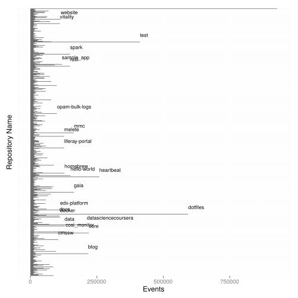

# Infrastructures in name only? The effects of depth and scale

Adrian Mackenzie, Sociology Department, Lancaster University.

a.mackenzie@lancaster.ac.uk

> Recently released NSA documents revealed the existence of FOXSCORE, a massive database that bugs traffic from major internet exchanges. General Keith Alexander, Director of the National Security Agency, assured the public that the program is rubber stamped by a secret court. (http://divergentdave.github.io/NSA-O-Matic/)

> Recently released NSA documents revealed the existence of WAGONWIND, a USB hardware host tap that deanonymizes communications satellites. An anonymous administration source assured the public that the program would only be used in the event of a national emergency. (http://divergentdave.github.io/NSA-O-Matic/)

NSA-O-Matic generates *names* of fictional US NSA (National Security Agency) surveillance sytems by compounding names of devices,  protocols and standards and naming them with proper names compounded from actually existing technical devices and systems. We know from the files released by Edward Snowden something of the existence of sprawling cyber-security systems such as XKEY, TREASUREMAP, SKYNET and so forth [@CJFE_2015], all of which might be broadly understood as knowledge infrastructures.  The Snowden revelations, in all their confusing variety, attest to a kind of combinatorial cacophony in building and operating knowing apparatuses. The humour of NSA-O-Matic derives partly from the disparity between the existence of a seemingly technically far-fetched juxtapositions -- USB hardware that deanonymizes communications satellites? -- and our still somewhat inchoate and stunned knowledge of tendrils growing into every aspect of contemporary communications (wireless routers, Skype conversations, network hubs, mobile phone conversations, social media, email messages, etc.). The public assurances extracted from U.S. government figures such as General Keith Alexander or Senator Dianne Feinstein only emphasise the threadbare democratic mandate for the existence of such systems.  

The combinatorial delirium is not unique to the NSA or government intelligence agencies of a similar ilk. The sheer variety of channels, devices, standards, modalities, platforms, scales of operation and levels of interdependency challenges  knowledge of infrastructure. At least in relation to networked communication and knowledge, our sense of scale and opacity owes much to names in combination.  NSA-O-Matic spoofs putative infrastructures. It compounds names to evoke opacity and depth.  While  important efforts are being made to map the connections between NSA 'programs' named in the Snowden documents and specific communications and computing devices that many of us use daily [@GuardianNews_2015], the sheer litany of  systems, platforms and elements that surface in these documents defy easy analysis. Yet this abundance imbues infrastructures with much of their structural depth, flexibility, power and fragility. If we stay close to the combinatorial play of NSA-O-Matic,  we might apprehend something of the  unfurling,  unstable opacity of contemporary infrastructures.  The names of their constituent fragments may attest to splintering [@Graham_2001] but also to the naturalisation of infrastructures [@Bowker_1999, 326]. 

If, like NSA-O-Matic, we apprehend infrastructures in name only, how do they appear to us? Somewhat inverse to tendencies to see depth and scale as the underpinning power dynamic, many contemporary infrastructures  proliferate names. At least for their interpretants,  this _nominalistic semiosis_ affects what counts as infrastructure.[^c.1] All structures, no matter how subterranean, act semiotically. Rusted bolts, cracked concrete plinths, the stanchions, bars, girders, plugs, cables, stone, steel, glass, rubber, oil, plastic, electricity, gas and springs participate in semiosis.  They function as indexes for infrastructural interpretants: rust suggests moisture, cloudy or black oil suggests wear, a buzzing indicates a friction, etc.  Diagrams accompany infrastructures, and on diagrams labels name components, processes, flows and structures. While we might approach contemporary instances in terms of the growth of forms such as 'platforms' [@Gillespie_2010] or increasingly programmed or protocol control [@Beniger_1986; @Galloway_2004], their aggregate consistency and variety owes much to the named entities that thread through many different media, communication, administrative and operational practices. Naming practices, then, might offer a viable way of navigating the dense patterns of code, protocols, standards, devices,  statements and operations that thicken people's  infrastructural practices. 

## Mapping infrastructures in names only

Where can nominalistic semiosis be studied? In online code repositories,  naming constitutes a primary practice of designation, manipulation and operation. All code inhabits name spaces.[^d.2]   Methodologically speaking, focusing on names might seem a bit counter-productive, since attention to  materiality, devices, things, non-human actors and practice in general been one of the hallmarks of the social studies of infrastructure. In the case of code-based infrastructures (and code inflects almost all knowledge infrastructures today), naming is a crucial practice. Naming operationally links people and things, places and devices together in complicated associations. Nearly all code heavily relies on naming practices. Whether viewed as a series of statements, commands or functions, naming and the forms of address associated with names weave inextricably through software. 

Code repositories store the source code, associated documents, files, configuration information and a variety of other materials associated with software.[^d.1] The largest repository of code repositories, the code repository platform (Github.com)[http://www.github.com] with around 20 million repositories  (in 2015) sprawling across many domains, epitomises nominalistic semiosis.   Github is rather like NSA-O-Matic writ large, since the code repositories it hosts not only address almost any kind of digital hardware and software practice one can imagine, but seem to be animated in their growth since 2007 by the same combinatorial delirium that NSA-O-Matic, itself a Github-hosted project, displays. It is difficult to characterise the heterogeneity of things, devices, conventions, platforms and organisations named in Github code repositories, and indeed, this difficulty is one of the motivations to approach what happens there in terms of names.

Github itself looks like a typical contemporary social media platform.  It has many of the appurtenances of participation ('followers', 'groups', 'watchers', 'stars', etc.;) and invokes the ethico-economic injunction to 'share' [@John_2013].  Github seeks to render coding itself 'social.'   It treats coding as a social practice of participation, somehow akin to photo-sharing or chatting with friends using a social media platform. In this respect,  infrastructures become the objects of social rituals and branded identifications.  The trappings of social media and its imperatives -- 'be social, share code' -- with their focus on networks of relations between people largely occlude the tremendous combinatorial processes occurring on Github and `git`-like platforms more generally. The fluxes of imitation of names and their recombinant energy constantly overflow the imperative to 'be social.' 

The names of repositories hosted on Github display a baffling polysemy. Repository names on Github can be any combination of letters or characters. These range from the almost casually random, yet still recognisable names such as  `asdf` (the first four characters on the home-row of an English keyboard) or `1234`, both of which number in their thousands through to highly recognisable names such as `linux` or `apache.` Both of the latter projects are well-known as key infrastructural elements of contemporary digital networks. On the one hand, the distance between repositories called 'asdf' and 'linux' is great. The former typically represent ephemeral contacts between individuals and infrastructures (for instance, many such repositories are the traces of people trying out or learning to use Github as an online code repository) and the latter encompass information network architectonics resulting from much collective effort. The `linux` kernel in particular represents one of the main cases in which coding work both became more visible as a cultural and social practice [@Coleman_2012; @Kelty_2008; @Mackenzie_2006], and practically permeated the information infrastructural *stack*.[^g.01] 

Between the two extremes of the random keypress repositories and the installed bulk of `linux` or `apache` lies a very diverse and dense population of names.   If we could read them serially in their spread and diversification over time, these names would diagram infrastructures multiplying, combining, and decaying in layers. Processes of repair, re-invention, appropriation, capitalisation and speculation are engrained in the distribution of names. The gamut of names of Github repositories, enough to populate a small country, is somewhat heterogeneous, pluralistic and full of transient multiplicities, but axes of organisation and centralisation that assemble infrastructural elements into something like the 'full stack' associated with the digital networks can be discerned there. Infrastructures like Github allocate all things a position in a common _namespace_. The Github  platform, with its infrastructures for storage, searching, tracking and graphing of coding work, arrays all repositories on the same surface. In this respect, it renders all differences superficial, and this superficiality is perhaps a somewhat novel experience in relation to infrastructure. The relations and connections between disparate bodies of code of many different ilk have only recently started to congregate in a common namespace.



\begin{figure}
  \centering
      \includegraphics[width=0.9\textwidth]{figure1_github_2014.pdf}
        \caption[Github repositories 2014]{Github repositories with more than 10,000 events in 2014. Repositories receiving more than 100,000 events during 2014 are labelled. }
  \label{fig:figure_repos}
\end{figure}


Figure \ref{fig:figure_repos} shows the most popular repositories on Github in 2014. Not all Github code repositories can be read as infrastructures, including several thousand repositories simply called `test`. But many of them, ranging from operating system such as `Linux` to code libraries for managing cloud-based deployments (`puppet`, `chef`, etc.) present a range of different namings. Some names represent generic practices -- `blog`, `web`, `data`, `test`. Others symbolise highly valued code territories -- `liferay-portal` or `edx-platform`. Some index individual configurations of practice -- `dotfile` and `homebrew` repositories usually store individual software developers' configuration files, a log in effect of how they arrange an equipmental totality to work on code. Finally, another set of names, such as `rust`, a systems programming language,  `spark`, an 'engine' for large-scale data processing, `docker`,  a platform to build, ship and run distributed applications,  and `heartbeat`, a system for monitoring web systems and services, designate current infrastructural practices as points of identification. 

Names condense the differences and associations between people and infrastructures. For instance, on Github, the names of code repositories when fully specified have a number of components. Take the 70,000 or so repositories whose names include the term `JQuery`.`JQuery` is a software library that supplies code for the buttons, animations, dynamic menus, etc. that we associate with interactive web pages (for instance, for buying a train ticket online). `JQuery`'s popularity amongst web developers -- more than 50% of all websites were making use of it in 2012 [@W3Techs_2012] -- arises from the way that it allows web pages written in HyperTextMarkupLanguage (HTML) to be programmatically manipulated as a set of named elements.  `JQuery` subjects the screen as a set of named elements subject to operations. Statements written using `JQuery` operate to generate text and graphics that people read, scroll, click, and select. This relatively banal example of how a page becomes a field of named entities pertains much more generally.  The much more obviously infrastructural operations of Amazon Web Services Elastic Compute 2 (AWS EC2), something similar appears. The approximately 21,000  Github repositories relating to AWS EC2 delineate a great range of concerns, but nearly all offer ways of naming, addressing and configuring instances of `linux` services operating in Amazon's data centres. Since they use different programming languages -- Haskell, Ruby, Python, Java or Javascript,   many different naming conventions permeate these repositories, but all of them invoke the operation of infrastructural elements in AWS EC2: disks, clusters, nodes, databases, servers and services spin up and spin down. 

## Names as cluster points

How does a cluster of 70,000 `JQuery` repositories or 20,000 AWS EC2 repositories take shape? Many repositories differ from each other _only_ in name. Some thousands of the `jQuery` repositories clone the primary `jQuery/jQuery` (or the jQuery Foundation's primary `jQuery` repository). Such repositories differ only through the name the person or organisation with whom they are  concatenated. Despite this imitation, the fully qualified naming of things is an important pre-occupation in contemporary infrastructural semiosis. In the case of Github, every repository has a unique proper name, even if it directly clones another repository. Nomination combines a person or organisation and a thing, device, system, convention, protocol or infrastructure. The base name for all the copies of `JQuery` is `jquery/JQuery`. The left hand part of the name is a person or an organisation, in this case, the JQuery organisation or the [jQuery Foundation](https://jquery.org/), while the right hand part points to a repository containing code that inevitably points to many further named elements. The full name of a repository always combines a person or organisation (`BBC`, `Google`, `Twitter`, `WhiteHouse`, `torvalds`, etc.) and a thing (`jQuery`, `bootstrap`. `linux`, `dotfile`, etc.).  Thus the fully qualified name of repository inextricably points in more than one direction. It does not index or symbolise either people or things but always a concatenation of organisation/person and device/thing.

Such concatenations are familiar in science and technology studies accounts of technologies and scientific knowledges (since they, for instance, lie at the base of actor-network theory accounts of translation and displacement [@Callon_1983] or human-machine configurations [@Suchman_2006]). Their sheer repetition does, however, intensify and thicken contemporary infrastructures in two specific ways: by linking infrastructural operations to subject positions. The very operation of the thing/device/system/framework/protocol/tool/technique and the position assigned to the subjects who make statements about the infrastructure come much closer together and indeed mingle in code. Strictly speaking, the subject position marked by the left hand end of a Github repository name overflows the  `/` that separates it from the body of code that addresses devices or systems on the right hand side. The situation here is captured well in Michel Foucault's account of the constituting and generating operations of statements in _The Archaeology of Knowledge_:

> In each case the position of the subject is linked to the existence of an operation that is both determined and present; in each case, the subject of the statement is also the subject of the operation (he who establishes the definition of a straight line is also he who states it; he who posits the existence of a finite series is also, and at the same time, he who states it) ; and in each case, the subject links, by means of this operation and the statement in which it is embodied , his future statements and operations (as an enunciating subject, he accepts this statement as his own law) [@Foucault_1972, 94-95].

Repositories comprise sequences of statements instituting the operating limits, the patterns of inscription and transcription, the regularities and usages that position subjects in infrastructures. These statements take effect, or implement something only through the coincidence that Foucault describes here. The subject of the statement is also the subject of the operation.  This is reminiscent of more recent accounts of performativity and things, but the embodiment of the operation in the statement -- and effectively I am suggesting that the repository name refers to such statements -- also mobilises future statements and operations. How so, in terms of what happens on  Github repositories?

The repetition and imitation of repositories also thickens infrastructures through small variations and combinations. While several thousand repositories directly clone `jquery/jquery`, the remainder vary it.  The vast majority of the repository names in which `jquery` appears also contain some other name. Composite names comprise much of the proliferating variation that combines `jquery` with other things. For instance, names such as:

```
jquery-postcode-anywhere
jquery-bingsearch
select2-json-php-mysql-bootstrap-jquery
jquery-django-formset
twitter-jquery-plugin
```

designate a range of compositions occurring around `jquery`, ranging from postal address systems (postcodes) through web search engines, layers in the internet stack (web servers, databases, web frameworks) and social media platforms. This sample of composite names is by no means representative since much of the compositional semiosis around `jquery` pivots on individual elements of web page user interfaces such as forms, menus, scrollbars and so on. Whether they stick closely to the graphic display of text and image or range more widely into the linkages between infrastructural layers, the combinatory composition that begins to appear in these repository names operates much more widely in mobilising infrastructures. Imitative and combinatory fluxes run across the millions of repositories on Github just at this banal level of repository names and naming. Other more fine-grained imitative and combinatory fluxes run much more deeply through the elements of coding, configuring, maintaining and repair work going on in the code.

## 'DevOps' and continuous deployment: when making becomes operating

The workings of deeper imitative fluxes are not easy to see in repository names. They might be discerned by selecting from amongst the millions of named repositories on Github some of those that relate not so much to the design and development of software but to its deployment, maintenance and repair. Amidst the millions of repositories on Github, disrepair and abandonment are extremely common. Many repositories contain a few items uploaded on some date.  Others have not been touched for months or years. Some repositories on Github, however,  show almost continuous patterns of contribution (developers adding or modifying the code). Others, perhaps fewer again, are not only often modified but constantly copied.[^j1] As we have seen earlier, the copying of a repository through the operation of forking or cloning is extremely common amongst developers as they diagrammatically construct services, platforms, devices and architectures. But some copying does not feed into code development.  It is cloning for operational deployment. Such so-called 'DevOps' -- development-operation -- repositories serve different purposes than software development, since they blur the line between making and operating infrastructures. The operation of infrastructures, its day to day adjustments, workarounds, contingencies and frictions, intersects with the making or development of the infrastructure. 

Perhaps the most straightforward example of a DevOp repository would be `github/github.` The repository itself is not publicly visible on  Github, yet its existence underpins the ongoing life and dynamism of Github as a social coding platform. As the several hundred developers employed by  Github modify, add or repair elements of the platform itself, their changes flow into the operation of Github  through continuous deployment routines that draw down changes from the `github/Github` onto the operating code of the Github platform. DevOps -- development operations - blurs the line between making and running, between designing and maintaining. We could also identify much more mundane versions of DevOps processes occurring in many repositories on Github. The many repositories containing names such 'dot' or 'dotfiles' or 'conf' do something similar at the level of individual developers development configuration. That is, they ensure a common and stable development environment for software developers amidst the many different configuration options possible (in relation to editors, compilers, file systems and various elements of the infrastructure that have to be rendered locally operable so that development for larger scale deployments can occur).

On the hand, they often contain specialised code focused on configuration of devices, systems, other software, services, and platforms. On the other hand, this specialized information is itself subject to generalization by virtue of its inclusion in a software repository. Configuration repositories are abound on Github because they allow the often intricate configuration details of contemporary software systems to be replicated quickly. Given that the scale of much information infrastructure is predicated on replicating the same thing multiple times, these configuration repositories reposition the management of infrastructure much closer to software development (e.g. a data-centre might be understood as a collection of identical computers linked together in ways that permit their processing to be coordinated and divided in many different ways; 'identical' here, however means managed through processes of replication.) 

'DevOps' re-fashion infrastructures through continuous deployment. It elides differences between making and operating is a striking feature of such infrastructures, and one that may affect the mode of existence of infrastructures more generally. Different infrastructural figures such as 'the platform,' 'the stack,' 'deployment' and 'build' intersect with various organisational, aesthetic, ethical and commercial regimes of engagement. A  combination of different materials ranging from images, texts, cloud or distributed computing services, various database and search engines, through to code repositories with their groups of contributors comprise the loose but interwoven infrastructures typical of such platforms.  They hold together in relational patterns that arise from recursive practice. 

Where does continuous deployment leave Github itself? I have been arguing that the combinatorial delirium generated by NSA-O-Matic resonates for us today because many infrastructures are compounded of names.   Is Github, then, a hub because it somehow has captured the nominalistic semiosis, or somehow made naming itself into the archive of this semiosis? Github attracts tremendous amounts of code (for instance, Google Corporation recently announced the closure of its own code repository service Google.code.com and migration of all code deposited there to Github [@Google_2015]; Microsoft Corporation has recently opened the source code of Windows, its main product, on Github, etc.).  Is Github a logistical success story (say like Singapore's role in container shipping) or a tremendous organic accumulation (say like Lagos in Nigeria, with its complicated flows of people, trade, oil and politics)? If we understand Github itself in terms of the nominalistic semiosis, then neither of these alternatives are quite right. Like many platforms, services, devices and systems, the logistical success of  Github (in coding and software deployment) depends on the tremendous morass of eccentric, abandoned, rarely used, ephemeral, miscellaneous and incredibly specific code and coding found there. The nominalisation of infrastructure, and its subsequent containerisation (many DevOps systems draw on shipping containers as their inspiration) in code not only speeds up or renders infrastructure development more flexible and variable. In this respect, Github is somewhat like a logistics hub in which moving things around somehow coincides with making them. The coincidence of making and distributing, developing and operating perhaps challenges any sense of solidity we might have in relation to infrastructure. 

## Conclusion

I have been suggesting that the flux of names in all their combinations and variations attests to both a thickening or stacking of contemporary infrastructures, and to the subject positions associated with that deepening. Infrastructures are mundane or sublime, I have been suggesting that in the case of software-affected infrastructures at least that names and naming practices help us practically engage with the full-stack complexities of contemporary infrastructures. Names in their linkages of people and devices, of 'dev' understood as a person, the software developer, 'dev' as a common abbreviation for device, and 'DevOps' as development-operation flow widely and deeply in contemporary software development. They attest to different and often overlapping movements. The imitative fluxes of names point to processes of replication and copying that propagate devices, protocols, standards and things in various configurations. I suggested that in contemporary information infrastructures, the form of the stack presents one organising axis of this propagation. But this layered architecture is viscously mixed in the concatenated names of many of the repositories on  Github. Both the replication of particular forms - `linux`, `jquery` - and their mutating combination can be seen in the repository names. 

Names not only provide a methodological traction on the infrastructural flux associated with software and coding practices, giving us some sense of the relative centrings and the predominant infrastructural rituals of our worlds. They operate generatively in several different senses.  First of all, the very act of naming every collection of code, code that may or may not do something in the world, implies an increasing addressability of diverse bodies of code. This addressability supports and engenders what I have been calling, loosely following Peirce, nominalistic semiosis. Second, the expansion of what is called a code repository to include almost any aspect of the structure, configuration, documentation and coordination of work associated with contemporary infrastructures means that the same regime of addressing in order to operate can generalization. Hence infrastructures increasingly unfurl by virtue of an ostensibly superficial nominalistic pragmatism. Third, this nominalistic semiosis is somewhat indifferent to distinctions between making and using, between design and deployment, and indeed to differences between what people and devices do. Across all of these distinctions, naming and calling by name operate interchangeably. This indifference or re-drawn difference between people and infrastructures generates a constant unfurling deployment in time and space. It lends itself to replication and variation, to changes in scale and variations in configuration. DevOps epitomises one highly distilled version of the nominalistic semiosis of infrastructure.  

Following on from both STS work on infrastructures and media theory accounts of embodied time-space, it makes sense to see unfurling as also generating spaces and times, and not simply located in space and time. Unfurling is result of the relatively heterogeneous and diverse scales stacked on each other to generate relative durations and extended replications. Yet this unfurling makes times and spaces as well since it derives from new forms of holding-together assayed by naming and addressing named things. This unfurling may be very predictable, and it may also be shaped by imaginaries (of the cloud, of mobile communication, of pervasive computing), but it will also bring to light new forms of holding together. The continuous building of DevOps would be one example of this. 

## References


[^j1]: Detecting repositories on Github that display this continuous development is not straightforward and involves some use of digital methods. In this case, I made use of the GithubArchive.org datasets as published in the Google BigQuery `GithubArchive` dataset. See http://bigquery.google.com/githubarchive [TBA - check url]

[^1]: An analysis of the pre-2007 trajectory of `linux` as a body of code can be found in [@Mackenzie_2006, Chapter 4].

[^g.01]: The stack comprises a diverse range of materials that could include storage systems (disk drives), servers, network resources, hardware specificities, data models and database architectures, business and transactional logics, software frameworks that connect elements of systems and architectures together, user interfaces including how screen elements such as graphics, interactive devices and text operate together. The first four layers of this stack, for instance, would be dominated by `linux` kernel versions, since the Android operating system, which has the largest installed base, is a version of `linux`. Or, if we turned from handheld devices to supercomputers, 97% reportedly use `linux.` This is clearly a repository of no little significance.  While `apache` is perhaps less well-known, it has for over a decade now has served the largest share of websites (around 40% or 340 million sites in January 2015 [@Netcraft_2015]).

[^c.1]: In 'Pragmatism in Retrospect: a Last Formulation,' C.S. Peirce writes, 'by semiosis, I mean ... an action, or influence, which is, or involves, a cooperation of _three_ subjects, such as a sign, its object, and its interpretant, this tri-relative influence not being in any way resolvable into actions between pairs' [@Peirce_1955, 282].  He goes on to note that the interpretant, the entity affected by an encounter with a sign is not necessarily a person, although it is easier to think about semiosis in terms of people. 

[^d.1]: The practices of working with code repositories on Github are quite complicated, and not the focus on discussion here. The advent of the `git` approach to the management of code has led to a very wide-ranging set of changes in the production of code, and Github has become the 'largest code repository on the planet' [@Git_2014] by centralising some of these shifts. Software engineering researchers have taken a keen interest in these repositories precisely because they seem to offer access to how software is actually built [@Takhteyev_2010; @Thung_2013]. 

[^d.2]: Code and coding have been widely discussed as making contemporary infrastructure what it is. The conceptual genealogies I draw on include science and technology studies accounts of information and scientific data infrastructures [@Bowker_2005; @Edwards_2011], as well as anthropological accounts of software in terms of recursion and freedom [@Kelty_2008; @Coleman_2013] (although it lies quite a long way from debates about open vs closed source code, the debate that monopolised attention to software during much of the last decade) and connections between network infrastructure and contemporary urban experience [@Graham_2001; @Thrift_2014].
